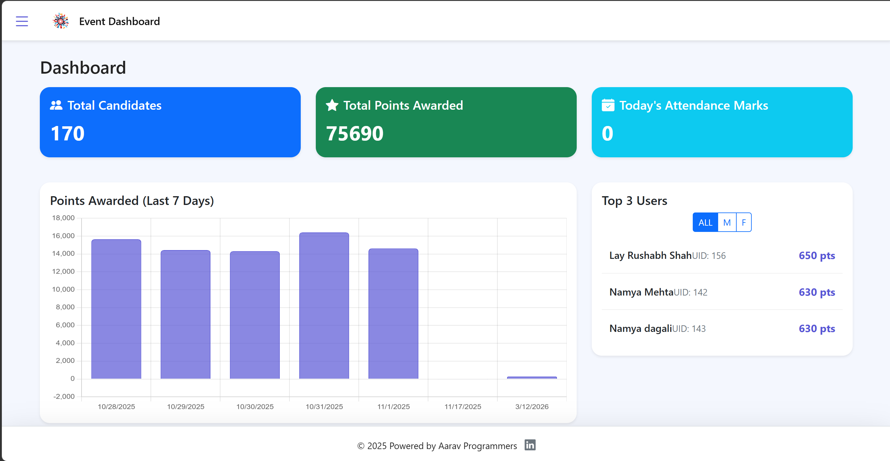
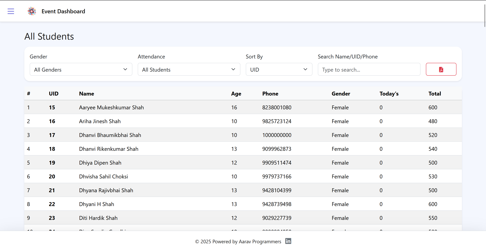

<h1 align="center">🎯 Event Management Dashboard</h1>
<p align="center">
  <em>A full-stack event operations platform for candidate management, attendance, points, analytics, and exports.</em>
</p>

<p align="center">
  
  
  
  
</p>

---

## 🚀 Overview

**Event Management Dashboard** helps admins run multi-day event programs from one place. It combines:

- admin login with session-based auth,
- candidate registration + search,
- points and attendance workflows,
- dashboard-level analytics and charts,
- one-click Excel backup export.

The project is built with **Node.js + Express** and uses **MySQL** for persistent storage.

---

## ✨ Core Features

- 🔐 Admin authentication (login/logout + protected APIs)
- 👤 Candidate creation with validation
- 📋 All-student view with filtering and sorting
- 🏆 Event points allocation (single or bulk candidate UIDs)
- ✅ Attendance marking by day (with duplicate protection)
- 📊 Dashboard summary cards + chart insights
- 🔎 Event search and participant drill-down
- 📝 Paper-marking utility table
- 📦 Excel backup download endpoint
- 🧾 Action logging via Winston (`action.log`)

---

## 🖼️ Screenshots (16:9)

<div align="center">
  
  
</div>

<p align="center">
  <sub><strong>Left:</strong> Login Screen &nbsp;•&nbsp; <strong>Right:</strong> Main Dashboard View</sub>
</p>

---

## 🧱 Project Structure

```text
Event-Managemet/
├── public/
│   ├── index.html
│   ├── login.html
│   ├── script.js
│   ├── login.js
│   ├── style.css
│   ├── event.ico
│   └── games/
│       ├── attend.html
│       ├── timer.html
│       ├── JCL.html
│       └── housie.html
├── pic/
│   ├── img1.png
│   └── img2.png
├── server.js
├── db.sql
├── create_admins.js
├── action.log
├── package.json
├── setup.bat
├── 1start_server.bat
└── 2start_host.bat
```

---

## ⚙️ Installation

### 1) Clone the repository

```bash
git clone https://github.com/aaravshah1311/Event-Managemet.git
cd Event-Managemet
```

### 2) Install dependencies

```bash
npm install
```

---

## 🗄️ Database Setup (MySQL)

### 1) Create database and tables

```bash
mysql -u root -p < db.sql
```

This creates:
- `event_manager` database
- `candidates` table
- `points_log` table
- `attendance` table
- `admins` table

### 2) Add admin users

Generate hashed-password SQL inserts:

```bash
node create_admins.js
```

Copy the generated SQL and run it in MySQL.

---

## 🔐 Configuration Note (No `.env` in this project)

As requested, this project currently **does not use `.env`**.
Update your DB credentials **directly inside `server.js`** in the `dbConfig` object:

```js
const dbConfig = {
  host: 'localhost',
  user: 'root',
  password: '',
  database: 'event_manager'
};
```

Also change the session secret in `server.js` before production use.

---

## ▶️ Run the Application

```bash
npm start
```

Server default:

```text
http://127.0.0.1:1311
```

Login page:

```text
http://127.0.0.1:1311/Login
```

---

## 🧪 Setup Checklist

- [ ] MySQL server is running
- [ ] `db.sql` imported successfully
- [ ] DB username/password updated in `server.js`
- [ ] `npm install` completed
- [ ] Admin users inserted into `admins` table
- [ ] Server starts with `npm start`

---

## 🛠️ Tech Stack

- **Backend:** Node.js, Express.js
- **Database:** MySQL (`mysql2/promise`)
- **Auth/Security:** `express-session`, `bcrypt`, `helmet`, `cors`
- **Reporting/Export:** `exceljs`
- **Logging:** `winston`
- **Frontend:** HTML, Bootstrap, vanilla JS, Chart.js

---

## 📌 Troubleshooting

- **`ER_ACCESS_DENIED_ERROR` / DB login failure**
  - Recheck `user` and `password` in `server.js`.
- **Login not working**
  - Confirm `admins` table has records with hashed passwords.
- **App opens but data is empty**
  - Ensure all tables in `db.sql` were created and populated.
- **Session issues after restart**
  - Clear browser cookies and log in again.

---

## 👤 Author

**Aarav Shah**

- GitHub: https://github.com/aaravshah1311/
- Portfolio: https://aaravshah1311.is-great.net
- Email: aaravprogrammers@gmail.com

---

<div align="center">
  <sub>Simple, fast, and reliable event-day management for admins.</sub>
</div>
